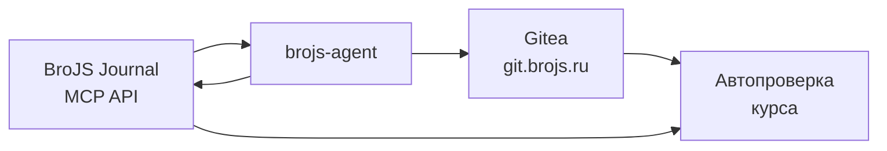
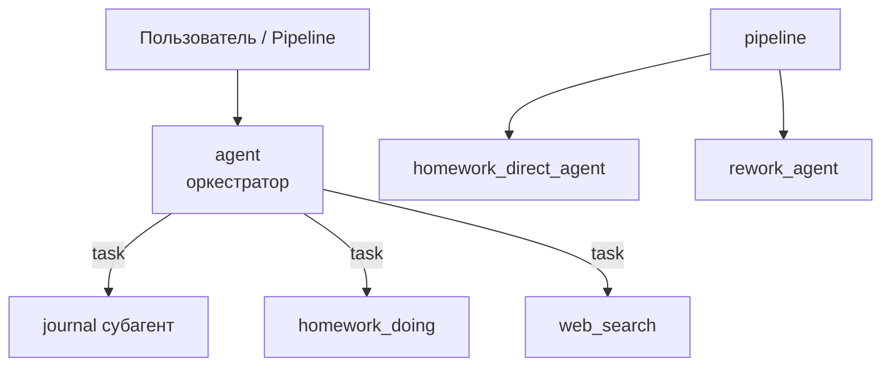
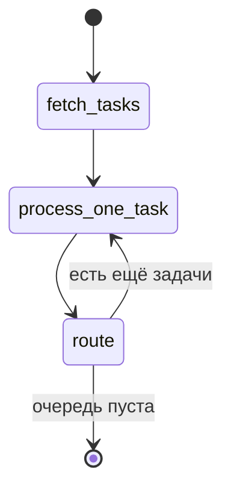
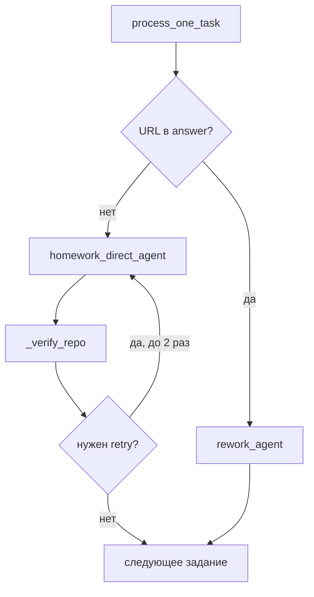

# brojs-agent — презентация проекта

> **Автор:** Роман Курлыгин  
> **Курс:** KFU-26-1 · [platform.brojs.ru](https://platform.brojs.ru)  
> **Репозиторий:** автоматизация домашних заданий через LangGraph + multi-agent

---

## Содержание

1. [О проекте](#1-о-проекте)
2. [Архитектура](#2-архитектура)
3. [Стек технологий](#3-стек-технологий)
4. [Карта репозитория](#4-карта-репозитория)
5. [Три агента — «мозг» системы](#5-три-агента--мозг-системы)
6. [Субагенты оркестратора](#6-субагенты-оркестратора)
7. [Pipeline LangGraph](#7-pipeline-langgraph)
8. [Цикл обработки одного задания](#8-цикл-обработки-одного-задания)
9. [Journal MCP и парсинг](#9-journal-mcp-и-парсинг)
10. [Промпты](#10-промпты)
11. [Инструменты](#11-инструменты)
12. [Middleware](#12-middleware)
13. [LLM и конфигурация](#13-llm-и-конфигурация)
14. [Запуск](#14-запуск)
15. [Пример: экзамен «Самокорректирующийся агент»](#15-пример-экзамен-самокорректирующийся-агент)
16. [Типичные проблемы](#16-типичные-проблемы)
17. [Итоги](#17-итоги)
18. [Шпаргалка для вопросов](#18-шпаргалка-для-вопросов)

---

## 1. О проекте

**brojs-agent** — агент для курса **KFU-26-1**, который автоматизирует полный цикл сдачи домашних работ:

| Этап | Действие |
|------|----------|
| 1 | Получить задания из **BroJS Journal** (MCP) |
| 2 | Сгенерировать решение (код или текст) |
| 3 | Опубликовать в **Gitea** (`git.brojs.ru`) |
| 4 | Отправить ссылку в журнал (`task_update_answer` → `task_submit`) |
| 5 | При отклонении — **пересдача** с учётом комментариев |

### Цели

- Минимизировать ручную рутину при сдаче ДЗ
- Поддержать **coding** и **non-coding** задания
- Учитывать требования **автопроверки** курса
- Дать два режима: **интерактивный чат** и **пакетный pipeline**

### Речь на 20 секунд

> «Проект — не просто чат с LLM, а конвейер: журнал → агент → Gitea → submit. При ревью преподавателя агент умеет пересдавать.»

---

## 2. Архитектура



### Роли компонентов

| Компонент | Роль |
|-----------|------|
| **Journal MCP** | Список заданий, текст ТЗ, сдача, статус |
| **Агент (deepagents)** | Планирование, вызов tools, генерация решения |
| **Gitea** | Хранение кода и README |
| **LangGraph pipeline** | Пакетная обработка всех `todo`-заданий |
| **OpenRouter** | LLM для рассуждений и генерации кода |

---

## 3. Стек технологий

| Слой | Технология | Зачем |
|------|------------|--------|
| Процесс | **LangGraph** | Ноды `fetch_tasks` → `process_one_task` → `route` |
| LLM + tools | **LangChain** | `ChatOpenAI`, messages, tool calling |
| Multi-agent | **deepagents** | Субагенты, VFS, память `AGENTS.md` |
| Журнал | **langchain-mcp-adapters** | HTTP MCP к platform.brojs.ru |
| Git-хостинг | **Gitea REST API** | Репозитории `task-{id}` |
| Локальный git | **subprocess** | Clone / push при пересдаче |
| LLM-провайдер | **OpenRouter** | OpenAI-compatible API |

### Как это связано

```text
LangChain  = кирпичи (модель, tools, сообщения)
LangGraph  = бизнес-процесс (очередь заданий)
deepagents = обёртка (субагенты + файловая система + память)
```

---

## 4. Карта репозитория

```text
brojs-agent-main/
│
├── agent.py                 # экспорт графов для LangGraph CLI
├── langgraph.json           # graphs: agent, pipeline
├── requirements.txt
├── .env / .env.example      # секреты (не в git)
│
└── src/agent/
    ├── agent.py             ★ сборка агентов (оркестратор, homework, rework)
    ├── graph/
    │   └── pipeline.py      ★ LangGraph: пакетная обработка
    ├── prompts.py           ★ все системные промпты
    ├── llm.py               # единый LLM (OpenRouter)
    ├── mcp_client.py        # Journal MCP
    ├── gitea_tools.py       # Gitea API
    ├── tools.py             # git + web search
    ├── subagents.py         # описания субагентов
    ├── constants.py         # COURSE_ID, пути, GITEA_OWNER
    ├── middlewares/         # защита workflow
    └── agent_workspace/     # клоны репо, рабочие файлы агента
```

> **На защите помни:** `agent.py` · `pipeline.py` · `prompts.py` — три главные точки входа в логику.

---

## 5. Три агента — «мозг» системы

Все собираются в **`src/agent/agent.py`** через `create_deep_agent`.

| Агент | Назначение | Когда используется |
|-------|------------|-------------------|
| **`agent`** | Оркестратор | Чат, делегирование субагентам через tool `task` |
| **`homework_direct_agent`** | Исполнитель | Первая сдача: ТЗ → repo → файлы → submit |
| **`rework_agent`** | Исполнитель | Пересдача: clone → правки → push → submit |



### Что внутри каждого агента

- `model` — из `llm.py`
- `system_prompt` — из `prompts.py`
- `tools` — Gitea, git, journal MCP, web
- `backend` — виртуальная ФС (`agent_workspace` + `/skills/`)
- `middleware` — см. [раздел 12](#12-middleware)

---

## 6. Субагенты оркестратора

Описания: **`subagents.py`** · промпты: **`prompts.py`**

| Имя | Задача |
|-----|--------|
| `journal_bh_tasks_submissions` | Чтение заданий, статусы, `task_update_answer`, `task_submit` |
| `homework_doing` | Полный цикл ДЗ (код + Gitea + журнал) |
| `web_search` | Поиск и чтение страниц (если нужен контекст) |

**Правило в промптах:** один tool-call за шаг ассистента — меньше хаоса и проще отладка.

---

## 7. Pipeline LangGraph

**Файл:** `src/agent/graph/pipeline.py`  
**Экспорт:** `agent.py` → `pipeline` (см. `langgraph.json`)

### Граф



### Ноды

| Нода | Функция |
|------|---------|
| **`fetch_tasks`** | `tasks_list` → парсинг → очередь `todo` / `in_progress` |
| **`process_one_task`** | Одно задание: homework или rework + verify + retry |
| **`route`** | `current_index < len(tasks)` ? loop : END |

### Состояние `PipelineState`

```python
tasks: list[TaskInfo]      # id, title, status
current_index: int
results: list[dict]
errors: list[str]
```

---

## 8. Цикл обработки одного задания



### Верификация репозитория (`_verify_repo`)

Проверяет файлы на Gitea **до** финальной сдачи (первая попытка):

| Тип задания | Ожидаемые файлы |
|-------------|-----------------|
| **coding** | `main.py`, `requirements.txt`, … |
| **non-coding** | `README.md`, `answer.md`, … |

**Типичные флаги автопроверки:**

- нет `build_*` при использовании LLM
- `localhost:1234`, `api_key="fake"`
- пустой или слишком короткий README

---

## 9. Journal MCP и парсинг

**Файл:** `src/agent/mcp_client.py`

| Параметр | Значение |
|----------|----------|
| URL | `https://platform.brojs.ru/jrnl-bh/api/mcp` |
| Auth | `Bearer {JOURNAL_TOKEN}` |
| Префикс tools | `mcp__journal-bh-professor__` |

### Основные инструменты

- `courses_list`, `lessons_list`
- `tasks_list`, `task_text`, `task_get`
- `task_update_answer`, `task_submit`
- `task_submission_status`, `task_comment`

### Цепочка парсинга (`pipeline.py`)

```text
MCP-ответ (список content-blocks)
        │
        ▼
  _parse_text()  →  строка JSON
        │
        ▼
  _parse_tasks()  →  [{ id, title, status }, ...]
```

---

## 10. Промпты

**Файл:** `src/agent/prompts.py` — «законы» поведения агента.

| Промпт | Агент |
|--------|-------|
| `main_agent_instructions` | Оркестратор |
| `homework_doing_instructions` | Первая сдача (пошаговый сценарий) |
| `rework_instructions` | Пересдача |
| `journal_tasks_submissions_instructions` | Journal-субагент |
| `research_instructions` | Web-субагент |

### Критичные правила (для зачёта и автопроверки)

1. **`task_update_answer` обязателен перед `task_submit`**
2. Различать **coding** / **non-coding**
3. Полный код без `pass`, `TODO`, `...`
4. `requirements.txt` с `langchain>1.0.0` для coding
5. Для LLM: `build_llm()` / `build_graph()`, без fake-ключей и localhost по умолчанию

### Сценарий первой сдачи (упрощённо)

```text
task_text → план → gitea_create_repo → gitea_write_file (каждый файл)
→ git_clone (проверка) → task_update_answer → task_submit
```

---

## 11. Инструменты

| Модуль | Инструменты | Назначение |
|--------|-------------|------------|
| `mcp_client.py` | `mcp__journal-bh-professor__*` | Журнал курса |
| `gitea_tools.py` | `gitea_create_repo`, `gitea_write_file`, … | Публикация файлов |
| `tools.py` | `git_clone`, `git_push`, `web_search`, … | Локальная работа и поиск |

### Именование репозитория

```text
https://git.brojs.ru/{GITEA_OWNER}/task-{taskId}
```

Пример: [task-6a1864fa8a94f887e50d46f0](https://git.brojs.ru/RomanKurlygin/task-6a1864fa8a94f887e50d46f0)

---

## 12. Middleware

**Папка:** `src/agent/middlewares/`

| Middleware | Что делает |
|------------|------------|
| **SanitizeToolCallsMiddleware** | Убирает/блокирует вызовы неизвестных tools |
| **ValidateJournalWorkflowMiddleware** | Не даёт вызвать `task_submit` без `task_update_answer` |

> Страховка от галлюцинаций имён tools и нарушения порядка сдачи.

---

## 13. LLM и конфигурация

**Файл:** `src/agent/llm.py`

| Переменная | Назначение |
|------------|------------|
| `OPENAI_API_KEY` | Ключ OpenRouter |
| `OPENROUTER_BASE_URL` | Обычно `https://openrouter.ai/api/v1` |
| `OPENAI_MODEL` / `OPENROUTER_MODEL` | Модель (по умолчанию `openai/gpt-oss-20b:free`) |
| `JOURNAL_TOKEN` | Только для **Journal MCP**, не для LLM* |

\* *При настройке «только OpenRouter» в `llm.py` journal-токен не используется для модели.*

### Rate limit

При **бесплатных** моделях OpenRouter длинный прогон агента (много tool + LLM шагов) может дать **HTTP 429** — «слишком много запросов». Решения: подождать, платная модель, свой ключ BYOK на [OpenRouter](https://openrouter.ai/settings/integrations).

---

## 14. Запуск

### Подготовка

```bash
git clone <repo>
cd brojs-agent-main
pip install -r requirements.txt
cp .env.example .env
# заполнить: OPENAI_API_KEY, JOURNAL_TOKEN, GITEA_TOKEN, GITEA_OWNER
```

### LangGraph Studio

```bash
pip install "langgraph-cli[inmem]"
langgraph dev --allow-blocking --port 2024
```

Графы из `langgraph.json`: **`agent`**, **`pipeline`**.

### Пакетный pipeline (все открытые задания)

```python
import asyncio
from src.agent.graph.pipeline import pipeline

async def main():
    state = {"tasks": [], "current_index": 0, "results": [], "errors": []}
    out = await pipeline.ainvoke(state, {"configurable": {"thread_id": "run-1"}})
    print("Готово:", len(out["results"]))
    if out["errors"]:
        print("Сбои:", out["errors"])

asyncio.run(main())
```

### Чат с оркестратором

```python
from src.agent.agent import agent
from langchain_core.messages import HumanMessage

# agent.ainvoke({"messages": [HumanMessage(content="...")]}, config)
```

---

## 15. Пример: экзамен «Самокорректирующийся агент»

| | |
|---|---|
| **Task ID** | `6a1864fa8a94f887e50d46f0` |
| **Суть** | LangGraph: execute → verify (LLM-judge) → retry |
| **Репозиторий** | [RomanKurlygin/task-6a1864fa8a94f887e50d46f0](https://git.brojs.ru/RomanKurlygin/task-6a1864fa8a94f887e50d46f0) |

### Что должно быть в решении

```text
START → execute_task → verify_result
              ↑ failed & attempts < max ← handle_error
              success / max_attempts → END
```

| Компонент | Описание |
|-----------|----------|
| `AgentState` | task, result, attempts, status, error, max_attempts |
| `unreliable_tool` | Случайные сбои для демо retry |
| `verify_result` | LLM отвечает `success` / `failed` |
| `build_graph()`, `build_llm()` | Для автопроверки |
| `InMemorySaver` | Checkpointing (опционально) |

### Демо

```bash
python main.py
python main.py "Вычисли 2+2"
```

---

## 16. Типичные проблемы

| Симптом | Причина | Как помогает проект |
|---------|---------|---------------------|
| `verdict_row` / падение на сервере | fake API, localhost, нет `build_*` | Промпты + `_verify_repo` |
| Submit без ответа | Пропущен `task_update_answer` | Middleware + промпт |
| Non-coding с `main.py` | Неверный тип задания | `_is_coding()` в pipeline |
| Rate limit 429 | Много вызовов free LLM | Retry, другая модель, пауза |
| Journal MCP 0 tools | Сеть / токен | Проверить `JOURNAL_TOKEN` |

---

## 17. Итоги

### Что построено

- **Конвейер сдачи ДЗ** для курса KFU-26-1
- **LangGraph-pipeline** для пакетной обработки
- **Multi-agent** система с разделением ролей
- **Интеграции:** Journal MCP + Gitea + OpenRouter
- **Надёжность:** middleware, верификация репо, retry

### Речь на 30 секунд (финал)

> «**brojs-agent** автоматизирует домашки: читает журнал, генерирует решение под тип задания, публикует на Gitea и сдаёт в курс. Архитектура: LangGraph для процесса, deepagents для исполнения, промпты и middleware для правил и автопроверки. При отклонении — пересдача с учётом комментариев преподавателя.»

---

## 18. Шпаргалка для вопросов

| Вопрос | Ответ |
|--------|--------|
| Где промпты? | `src/agent/prompts.py` |
| Где ноды pipeline? | `src/agent/graph/pipeline.py` |
| Где парсинг `tasks_list`? | `_parse_text`, `_parse_tasks` в `pipeline.py` |
| Где три агента? | `src/agent/agent.py` |
| Как запустить всё подряд? | `pipeline.ainvoke(...)` |
| Зачем deepagents? | Субагенты, VFS, память `AGENTS.md` |
| Что такое rate limit? | Лимит частоты запросов к API (ошибка 429) |
| Где ID курса? | `constants.py` → `COURSE_ID` |
| Куда кладутся клоны? | `src/agent/agent_workspace/` |

---

## Связанные материалы

- [README.md](./README.md) — быстрый старт
- [PROJECT_DEFENSE_GUIDE.md](./PROJECT_DEFENSE_GUIDE.md) — шпаргалка для защиты
- [LangGraph concepts](https://langchain-ai.github.io/langgraph/concepts/)

---

*Документ для подготовки слайдов. Скопируйте разделы в PowerPoint / Google Slides — один `##` = один слайд.*
