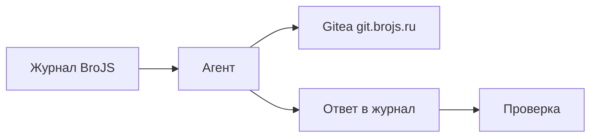

# KFU Course Agent

Автоматизация домашних заданий курса **KFU-26-1** на [platform.brojs.ru](https://platform.brojs.ru): агент сам находит открытые задачи, пишет решение, публикует репозиторий и сдаёт работу.

## Как это устроено



| Этап | Действие |
|------|----------|
| 1 | Список незакрытых заданий через Journal MCP |
| 2 | Генерация Python-решения |
| 3 | Репозиторий `git.brojs.ru/<ваш-логин>/task-<id>` |
| 4 | Коммит через Gitea API |
| 5 | Ссылка в ответ + `task_submit` |
| 6 | При отклонении — клон, правки, повторная отправка |

## Требования

- Python **3.11+**
- Ключи в `.env` (см. ниже)

**Зависимости:** [deepagents](https://github.com/langchain-ai/deepagents), [LangGraph](https://github.com/langchain-ai/langgraph), [LangChain](https://python.langchain.com/), OpenRouter (`gpt-oss-20b:free`), Gitea API, BroJS Journal MCP.

## Быстрый старт

```bash
git clone https://github.com/Glevelll/brojs-agent.git
cd brojs-agent
pip install -r requirements.txt
cp .env.example .env
# заполните .env реальными ключами
```

### Переменные окружения

| Переменная | Назначение | Где взять |
|------------|------------|-----------|
| `OPENAI_API_KEY` | LLM через OpenRouter | [openrouter.ai/settings/keys](https://openrouter.ai/settings/keys) |
| `JOURNAL_TOKEN` | API журнала | platform.brojs.ru → профиль → токены |
| `GITEA_TOKEN` | git.brojs.ru | Settings → Applications → Access Tokens |
| `GITEA_OWNER` | Логин на git.brojs.ru (владелец репозиториев) | Профиль Gitea → имя пользователя |
| `TAVILY_API_KEY` | Поиск в сети (необязательно) | [tavily.com](https://tavily.com) |

Файл `.env` не коммитится — он в `.gitignore`.

## Запуск

### Пайплайн (все открытые coding-задания)

```bash
python -c "
import asyncio
from src.agent.graph.pipeline import pipeline

async def main():
    state = {'tasks': [], 'current_index': 0, 'results': [], 'errors': []}
    cfg = {'configurable': {'thread_id': 'run-1'}}
    out = await pipeline.ainvoke(state, cfg)
    print('Готово:', len(out['results']))
    if out['errors']:
        print('Сбои:', out['errors'])

asyncio.run(main())
"
```

### LangGraph Studio

```bash
pip install "langgraph-cli[inmem]"
langgraph dev --allow-blocking --port 2024
```

UI: [LangSmith Studio](https://smith.langchain.com/studio/?baseUrl=http://127.0.0.1:2024)

### Веб-интерфейс (рекомендуется)

```bash
pip install fastapi "uvicorn[standard]"
python scripts/run_ui.py
```

Откройте в браузере: **http://127.0.0.1:8765**

- карточки статуса `.env` и кнопки проверки Journal / Gitea;
- чат с оркестратором и быстрые подсказки;
- запуск пайплайна с журналом событий в реальном времени.

### Чат с оркестратором (терминал)

```bash
python -c "
import asyncio
from src.agent.agent import agent
from langchain_core.messages import HumanMessage

async def main():
    cfg = {'configurable': {'thread_id': 'chat-1'}}
    while True:
        q = input('> ').strip()
        if q in ('exit', 'quit', 'q'):
            break
        r = await agent.ainvoke({'messages': [HumanMessage(content=q)]}, cfg)
        print(r['messages'][-1].content)

asyncio.run(main())
"
```

## Карта репозитория

```
.
├── agent.py              # экспорт для langgraph dev
├── langgraph.json
├── requirements.txt
├── .env.example
└── src/agent/
    ├── agent.py          # оркестратор, homework, rework
    ├── graph/pipeline.py # пакетная обработка заданий
    ├── prompts.py
    ├── gitea_tools.py
    ├── mcp_client.py
    ├── middlewares/
    └── agent_workspace/  # клоны репозиториев
```

## Секреты в коде

Плейсхолдеры подхватываются из `.env`:

| Модуль | Переменная |
|--------|------------|
| `llm.py` | `OPENAI_API_KEY` |
| `mcp_client.py` | `JOURNAL_TOKEN` |
| `gitea_tools.py` | `GITEA_TOKEN` |
